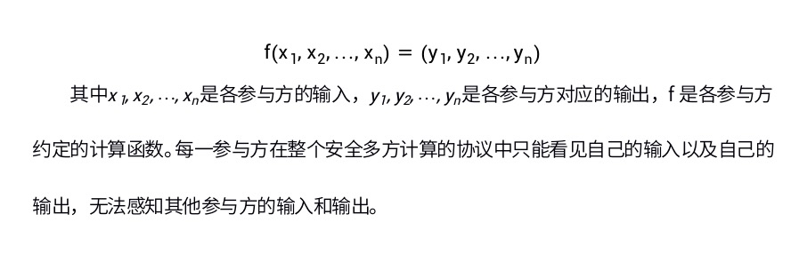

# 区块链溯源

## 区块链溯源介绍
> 区块链溯源是指利用区块链技术，通过其独特的、不可篡改的分布式账本记录特性与物联网等技术相结合，对商品实现从源头的信息采集记录、原料来源追溯、生产过程、加工环节、仓储信息、检验批次、物流周转，到第三方质检、海关出入境、防伪鉴证的全程可追溯. 区块链溯源技术应用已延伸到数字金融、物联网、智能制造、供应链管理、数字资产交易等多个领域.
- 区块链+溯源，不能解决被溯源产品（或信息）的真假和品质好坏问题，只作为数字化存证工具，方便大家进行回溯、追踪等。
  + 平时跟大家交流时，都会被问到：如何解决上链之前的真假问题。其实，这是不正确的，是对区块链在溯源应用上的理解走进了基于消费预期的误区。
  + 本质上，区块链+溯源是从时间和空间的二维角度，对产品（或信息）的生产、流通和消费过程进行记录，且不可窜改，这个过程可能会涉及物联网设施，目的是实现用技术来讲述产品（或信息）的品牌故事，让大家可以客观了解产品（或信息）的价值。
  + 如果想解决上链之前原始性问题，需要脱离人的参与，全过程均采用技术方式实现。
  + 如果这样，成本会成为至关重要的应用区块链+溯源技术的决策性元素，如果标的产品（或信息）附加值不足以覆盖成本时，应用价值不大，就很难实现落地，就无法被溯源、被管理、被了解，从而最终产品（信息）被消费、管理能力被提升、运营管理成本被节约。
  + 那么，切实可行的方法是：根据标的产品（或信息）的附加值空间来进行溯源深度的控制。
  + 区块链化后，您要为自己上链的信息和数据资料负责。当遇到消费投诉、政府监管盘查等问题时，区块链技术的不可窜改的存证特性会增加您的造假成本。
  + 区块链+溯源是通过增加造假成本的方式来达到优化劣币驱逐良币的市场环境。并不能直接解决标的产品（或信息）的真假及品质问题。

- 大家理解的溯源，不应包含防伪技术，防伪技术是相对独立的管理工具。
  + 当您的品牌具有消费价值时，或者当您的供应链条较为复杂时，会存在伪劣假冒的问题。而溯源技术本身不能直接解决伪劣假冒的问题。原因在于面向消费者的溯源承载媒介（二维码、EPC电子标签、盛器与包装媒介等）是可复制或可重复利用的，但消费者的辨识能力不足，容易形成造假空间。这个问题，需要引入防伪技术，与溯源进行结合。它可能是物理的防伪标识，也可能是一种供应链管理机制或是一种消费闭环激励措施等。

- 目前市场上区块链+溯源的定义相对较窄，被溯源的对象不仅仅是针对物理层的实物产品，还应该囊括纯线上的信息及数据服务等。
  + 随着信息化时代的发展，各类社会活动均会产生大量的信息和数据，如金融服务、大宗交易、商品贸易、日常消费、产品质量与供应链管理、社交互动、电子政务、游戏活 动以及物联网/互联网安全等。
  + 这些信息数据往往经过了各种各样的“包装”变成了一种可以交易的资产被社会广泛地接受。
  + 数据变成资产后,具备了流动性,金融属性就变得很强, 围绕数据进行交易成为了催生信息产业升级的元力。
  + 同时，也成为了滋生信息的暗网交易、个人隐 私数据泄漏、基于大数据杀熟营销、行业溯源造假等一些灰色的产业生态。
  + 另外，由于行业竞争力加剧,社会信用机能不足、企业保护商业隐私等原因使得业务发展过程产生的数据和信息无法联通、不能共享与交换,成为了制约大数据产业应用的障碍。 如何明确数据信息主体、客体的权责边界；如何形成良好的数据开发和使用氛围，处理好安全和发展的关系。区块链+溯源（确权登记）可以得到很好的应用，针对2C的信息溯源应用市场空间巨大。

- 区块链+溯源，有必要引入通证经济逻辑，只有这样才可以有效推动应用溯源技术去证明产品（信息）的价值过程，同时可以低成本的避免伪劣假冒乱象。
  + 目前，市场上的溯源产品应用从一定意义没有形成有效闭环，原因在于消费端用户还没有形成通过使用查询工具来了解产品详情的习惯以及动力。
  + 缺失消费端的数据，会让应用溯源技术的价值大打折扣。试想，当我们证明标的产品（或信息）具有高附加值之后，却没有让促进消费（销售）来帮助它们实现价值变现，标的产品（或拥有信息）的主体是否会重新思考和评估是否接受溯源的服务呢？
  + 区块链的通证经济逻辑恰好可以有效弥补这个问题，用消费挖矿（返币）的方式驱动消费端使用查询工具了解标的产品（或信息）的价值所在，从而进一步认可品牌价值，达到消费甚至持续消费的目的。
  + 有了消费端的数据之后，被溯源的标的产品（或信息）主体可以借助大数据、人工智能等技术进行精准市场投放和营销，并可以继续使用“消费即挖矿”增强消费者的品牌依赖度，还可以使用“推广即挖矿”来促进品牌的间接被动营销。
  + 另外，因为发售（发行）生态token，并通过合理的方式让它在特定平台具有流通性，成本较高。引入通证经济逻辑之后，形成了一个技术壁垒，天然具有防伪造假的能力。
  + 最后，有通证支撑后，因为参与记账的节点利益不一致性，让基于区块链技术的溯源信息更具有可信度。

## 关键技术

### 链上和链下数据协同

> 传统区块链系统在提供去中心化、安全、不可篡改等特性的同时通常面临性能瓶颈，例如交易处理速度较慢，吞吐量有限。随着应用规模的扩大，这些问题可能变得更加严重，从而限制了区块链应用的广泛应用。链上链下协同可以在满足核心区块链特性的前提下，将部分计算和数据存储任务转移到链下，从而提高系统性能和扩展性。这种协同方式使得区块链应用能够在实现高效运行的同时，满足大规模、高并发的业务场景需求。

> 在区块链领域，链上（On-chain）和链下（Off-chain）是两个关键概念。链上指的是发生在区块链网络上的所有活动，例如交易、智能合约的执行等。链下则指的是发生在区块链网络之外的活动，例如一些业务逻辑处理、数据存储等。 
> 链上链下协同是指链上数据与链下数据之间的交互和协作关系，通过将链上和链下数据与操作相互关联，从而实现业务流程的整体优化。例如，链下业务逻辑处理可以基于链上的智能合约执行结果，而链上的智能合约也可以根据链下数据的验证来执行相应操作。

[知乎-一文说清区块链的“链上”和“链下”](https://zhuanlan.zhihu.com/p/139490040)

[知乎-区块链之链上链下协同的实现与挑战](https://zhuanlan.zhihu.com/p/627267830)

### 共识机制

#### PBFT

> PBFT是Practical Byzantine Fault Tolerance的缩写，即实用拜占庭容错算法。该算法是Miguel Castro和Barbara Liskov在1999年提出来的，可以在作恶节点少于总节点的三分之一的情况下，保证所有节点能达成共识.

[在区块链上实现PBFT实用拜占庭容错共识](https://www.jianshu.com/p/56f60fe349e0)

从发起请求到收到最终结果，中间的共识过程一共需要经过3个阶段，怎样从区块链的角度来理解呢？

首先，0，1，2，3都是区块链上的验证节点。C在原论文里是定义为客户端，共识的需求由C来提出。区块链没有客户端，但是它有共识的需求。所以，C在这里就可以理解成区块链本身。

所以，先由C发出请求（request），请求发给0。我们可以理解成区块链选定0做为出块节点。然后进入三阶段协议。

pre-prepare阶段：0 被选为出块节点后，就生成新区块并对全网广播，通知1，2，3节点接收新区块。节点3打了一个叉，可以理解成节点3掉线了。

prepare：1，2，3节点收到这个区块后，需要告知所有其他节点它已经收到区块了。所以，这里会有 n^2 条信息发出。3因为掉线了，所以它没有发消息。

commit：只要收到全网超过2/3的节点告知已收到同一个区块，就可以认为这是大家需要共同验证的下一个区块。于是所有节点在这个阶段对区块进行验证，验证成功就把确认结果发给所有其他节点。

三阶段结束后，所有人再将最终结果提交给客户（reply），也就是区块链。只要有超过2/3的人同意将新区块加到链上，区块就会被加上去。

#### Kafka

Kafka本质上是一个消息处理系统，它使用的是经典的发布-订阅模型。消息的消费者订阅特定的主题，以便收到新消息的通知，生产者则负责消息的发布。

当主题的数据规模变得越来越大时，可以拆分为多个分区，Kafka保障在一个分区内的消息是按顺序排列的。

Kafka并不跟踪消费者读取了哪些消息，也不会自动删除已经读取的消息。Kafka会保存消息一段时间，例如一天，或者直到数据规模超过一定的阈值。消费者需要轮询新的消息，这使得他们可以根据自己的需求来定位消息，因此可以重放或重新处理事件。消费者处于不同的消费者分组，对应一个或多个消费者进程。每个分区被分贝给单一的消费者进程，因此同样的消息不会被多次读取。

崩溃容错机制是通过在多个Kafka代理之间复制分区来实现的。因此如果一个代理由于软件或硬件故障挂掉，数据也不会丢失。当然接下来还需要一个领导-跟随机制，领导者持有分区，跟随者则进行分区的复制。当领导者挂掉后，会有某个跟随者转变为新的领导者。

zookeeper是一个分布式key-value存储库，通常用于存储元数据及集群机制的实现。zookeeper允许服务（Kafka代理）的客户端订阅变化并获得实时通知。这就是代理如何确定应当使用哪个分区领导者的原因。zookeeper有超强的故障容错能力，因此Kafka的运行严重依赖于它。

Chain - 指的是一组客户端（通道/channel）可以访问的日志

Channel - 一个通道类似于一个主题，授权的对等节点（peer）可以订阅并且成为通道的成员。 只有通道的成员可以在通道上交易，一个通道中的交易在其他通道中看不到

OSN - 即排序服务节点（Ordering Service Node），在Fabric中被称为排序节点。排序节点负责：
+ 进行客户鉴权 
+ 允许客户端通过一个简单的接口写入或读取通道 
+ 执行配置交易的过滤与验证，实现通道的重新配置或创建新的通道

RPC - 即远程过程调用（Remote Procedure Call），是一种用于调用其他机器上的服务而无需了解 通信与实现细节的通信协议，目的是像调用本地函数一样调用网络中其他机器上的函数
+ 广播PRC - 交易提交调用，由排序节点执行
+ 分发RPC - 交易分发请求，当交易由kafka代理处理后，分发给请求节点

Kafka实际运行逻辑如下：

+ 对于每一条链，都有一个对应的分区
+ 每个链对应一个单一的分区主题
+ 排序节点负责将来自特定链的交易（通过广播RPC接收）中继到对应的分区
+ 排序节点可以读取分区并获得在所有排序节点间达成一致的排序交易列表
+ 一个链中的交易是定时分批处理的，也就是说当一个新的批次的第一个交易进来时，开始计时
+ 当交易达到最大数量时或超时后进行批次切分，生成新的区块
+ 定时交易是另一个交易，由上面描述的定时器生成
+ 每个排序节点为每个链维护一个本地日志，生成的区块保存在本地账本中
+ 交易区块通过分发RPC返回客户端
+ 当发生崩溃时，可以利用不同的排序节点分发区块，因为所有的排序节点都维护有本地日志

### 数据隐私保护

#### 数字签名

数字签名是一种用于保证数据完整性、认证数据来源的技术。数字签名的基本原理是使用私钥对数据进行加密，然后使用公钥对加密后的数据进行解密，从而验证数据的完整性和真实性。数字签名主要有三大作用：认证、防止抵赖和保证文件完整性。

#### 零知识证明

> 零知识证明（Zero-Knowledge Proof, ZKP）是一种证明，它指的是证明者在不对验证者提供任何有用信息的情况下，仍可证明某一论断的正确性

[彻底读懂零知识证明及其实现方法：解析zk-SNARK](https://learnblockchain.cn/article/1662)

zkSNARKs

A) 编码成一个多项式问题

把需要验证的程序编写成一个多项式方程：t(x) h(x) = w(x) v(x)，当且仅当程序的计算结果正确时这个等式才成立。证明者需要说服验证者这个等式成立。

B) 简单随机抽样

验证者会选择一个私密评估点 s 来将多项式乘法和验证多项式函数相等的问题简化成简单乘法和验证等式 t(s)h(s) = w(s)v(s) 的问题。

这样做不但可以减小证明量，还可以大量的减少验证所需的时间。

C) 同态（Homomorphic）编码 / 加密

我们使用一个拥有一些同态属性的（并不需要完全同态，因为完全同态目前尚不实用）编码 / 加密函数 E。这个函数允许证明者在不知道 s 的情况下计算 E(t(s)), E(h(s)), E(w(s)), E(v(s))，她只知道 E(s) 和一些其他有用的加密信息。

D) 零知识

证明者通过乘以一个数来替换 E(t(s)), E(h(s)), E(w(s)), E(v(s)) 的值，这样验证者就可以在不知道真实的编码值的情况下验证他们正确的结构了。

#### 多方安全计算

安全多方计算是指在无可信第三方的情况下，多个参与方协同计算一个约定的函数，并且保证每一方仅获取自己的计算结果，无法通过计算过程中的交互数据推测出其他任意一方的输入和输出数据（除非函数本身可以由自己的输入推测出其他参与方的输入和输出）。

安全多方计算可抽象概括为数学模型，其公式如下：

安全多方计算技术并不是一个单一的技术，它本身是由一些列技术组成的协议栈。按层次可为2层，如下图所示：

#### 联邦学习

联邦学习定义了机器学习框架，在此框架下通过设计虚拟模型解决不同数据拥有方在不交换数据的情况下进行协作的问题。虚拟模型是各方将数据聚合在一起的最优模型，各自区域依据模型为本地目标服务。联邦学习要求此建模结果应当无限接近传统模式，即将多个数据拥有方的数据汇聚到一处进行建模的结果。在联邦机制下，各参与者的身份和地位相同，可建立共享数据策略。由于数据不发生转移，因此不会泄露用户隐私或影响数据规范。为了保护数据隐私、满足合法合规的要求。

联邦学习有三大构成要素：数据源、联邦学习系统、用户。三者间关系如图所示，在联邦学习系统下，各个数据源方进行数据预处理，共同建立及其学习模型，并将输出结果反馈给用户。

横向联邦学习

纵向联邦学习

联邦迁移学习

## 技术实践

看pdf

## 技术展望

### 跨链技术

### 跨链技术

跨链技术（Cross-Chain Technology）是指在不同的区块链之间进行数据和资产的互通，实现不同区块链之间的互操作性。由于不同的区块链之间存在着不同的共识算法、数据结构和网络协议等差异，因此实现跨链技术需要解决诸多技术难题。目前，主要的跨链技术包括原子交换、侧链、中继链、分片等。

